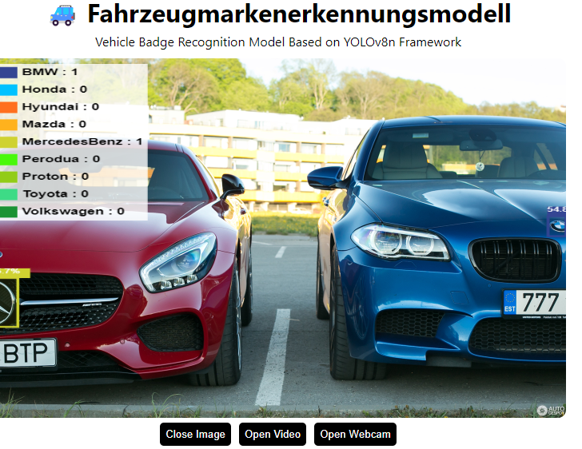
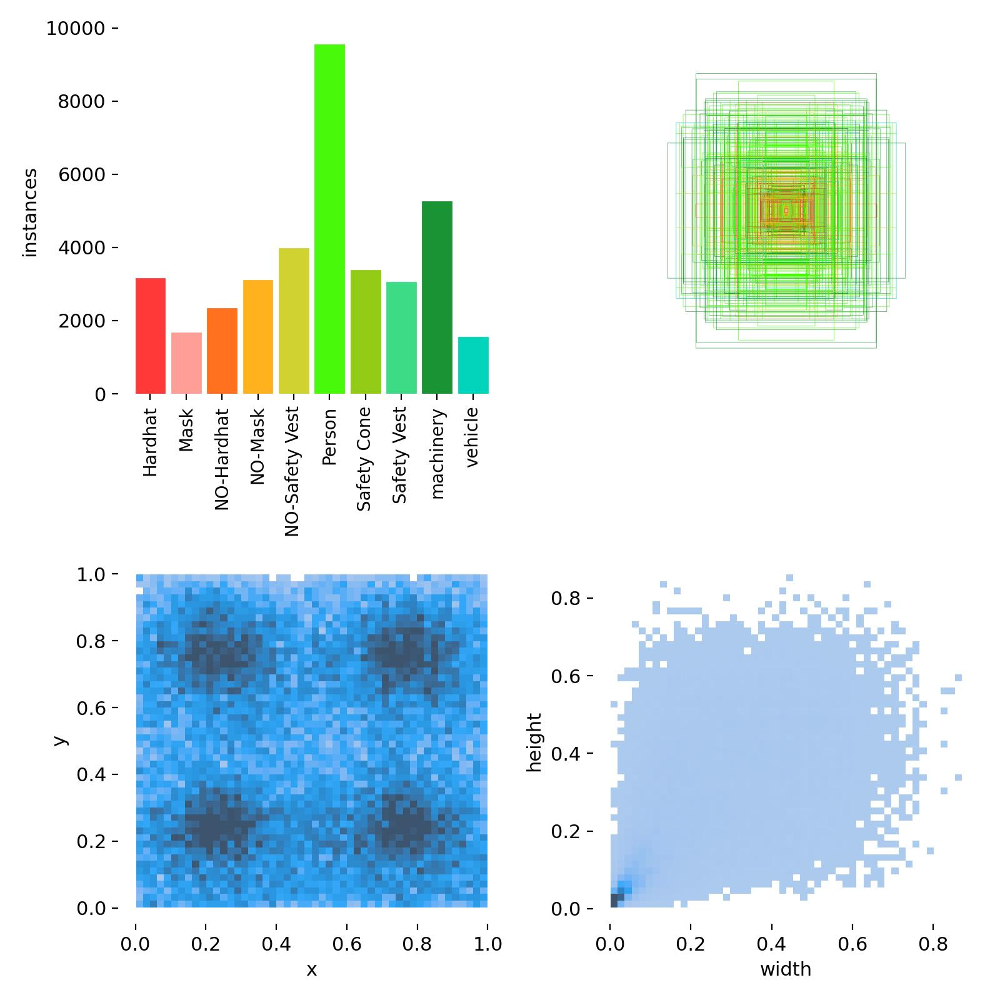
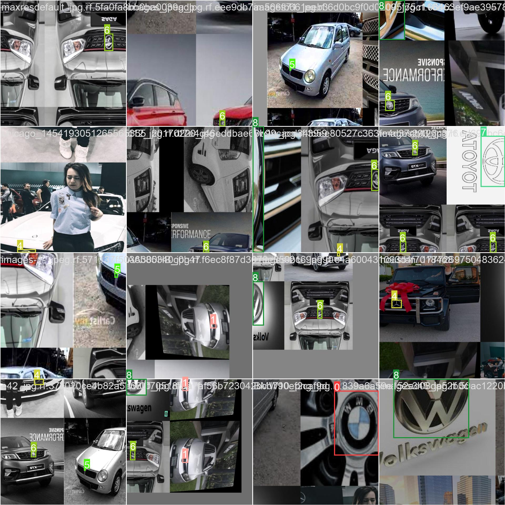
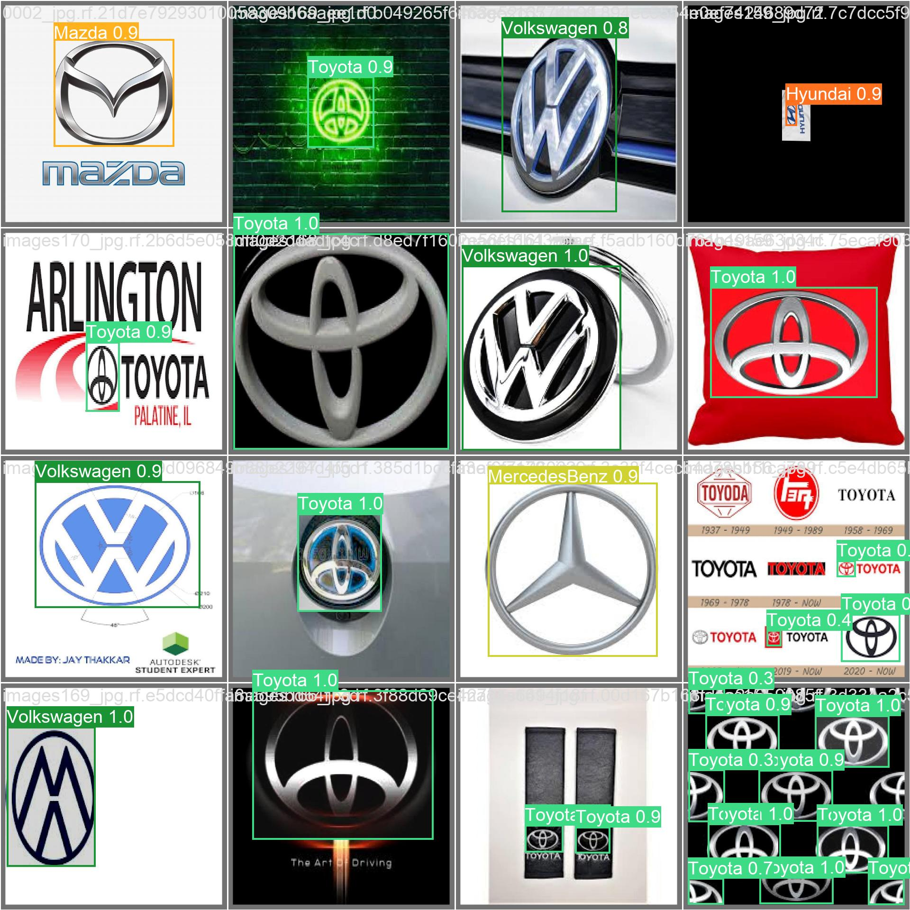
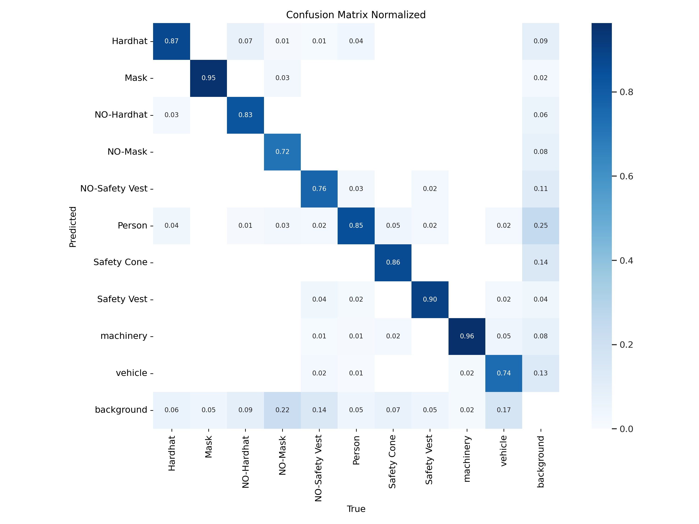
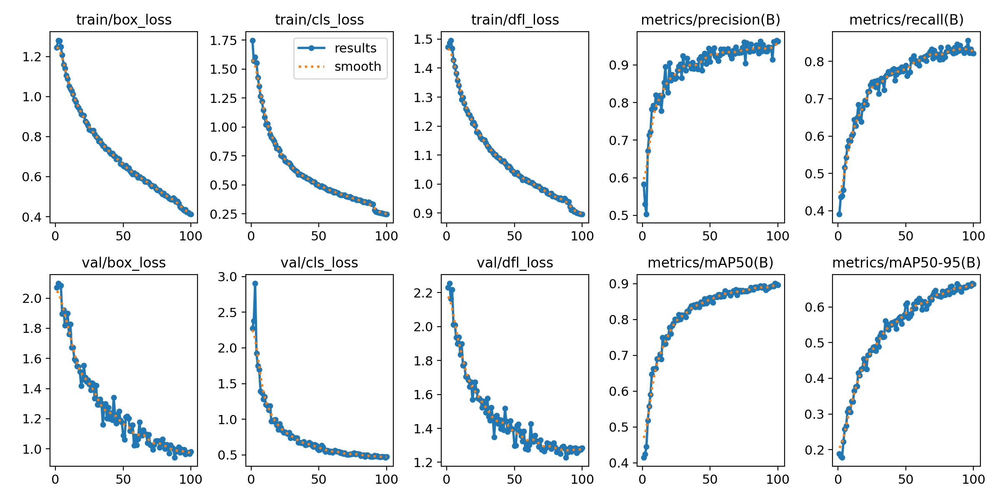

# Fahrzeugmarkenerkennungsmodell

<p align="center">
  
</p>


---

Über den folgenden Link können Sie Ihre Bilder oder Videos direkt hochladen und testen, sogar Live-Videos von Ihrer Kamera können getestet werden.

Through the link below, you can directly upload and test your images or videos, even test video streams from your camera.

## Link 
https://miaoima.github.io/CarBrandRecogn/

---


### DE
---

**Projektübersicht**

Dieses Projekt zielt darauf ab, ein Modell zu entwickeln, das verschiedene Fahrzeugmarken, einschließlich ['BMW', 'Honda', 'Hyundai', 'Mazda', 'MercedesBenz', 'Perodua', 'Proton', 'Toyota', 'Volkswagen'], erkennen kann. 
<p align="center">
  
</p>

<p align="center">
  
</p>

In Anbetracht der Tatsache, dass Fahrzeugmarken im Vergleich zum gesamten Fahrzeug klein sind, besonders wenn Bilder undeutlich sind, stellt die Modellvorhersage eine bestimmte Herausforderung dar. 
<p align="center">
  
</p>

Die Beobachtung der Vorhersageergebnisse zeigt, dass das Modell zufriedenstellende Ergebnisse liefert, wenn die Fahrzeugmarke einen größeren Teil des Bildes ausmacht, und weniger zufriedenstellend, wenn dies nicht der Fall ist.
<p align="center">
  
</p>


**Mögliche Modellverbesserungen:**
1. Erhöhung der Trainingsepochen: Aus der Loss-Grafik des Modells geht hervor, dass der Loss-Wert weiterhin einen Abwärtstrend aufweist, was darauf hindeutet, dass das Modell durch Erhöhung der Trainingsepochen weiter optimiert werden könnte.
<p align="center">
  
</p>

2. Einführung von mehr Daten mit Bildern des gesamten Fahrzeugs: Das Hinzufügen von mehr Bildern des gesamten Fahrzeugs zum Trainingssatz kann dazu beitragen, dass das Modell Fahrzeugmarken genauer erkennt.
3. Erprobung anderer YOLO-Modelle: Zum Beispiel könnte der Einsatz des YOLOv8x-Modells in Erwägung gezogen werden. Obwohl es über mehr Parameter verfügt und daher längere Trainings- und Reaktionszeiten erfordert, wird erwartet, dass es in Bezug auf die Vorhersagegenauigkeit besser abschneidet.

In der Zukunft könnte ein idealer Ansatz darin bestehen, zunächst die Position der Fahrzeugmarke zu erkennen, dann gezielt Bilder der Fahrzeugmarke auszuschneiden und zu erkennen. Diese Methode könnte sowohl in Bezug auf Genauigkeit als auch Effizienz eine gute Balance bieten und wird im nächsten Schritt unser Fokus sein.

---

### EN 
---

**Project Overview**

This project aims to develop a model that can identify different vehicle badges, including ['BMW', 'Honda', 'Hyundai', 'Mazda', 'MercedesBenz', 'Perodua', 'Proton', 'Toyota', 'Volkswagen']. Considering that vehicle badges are small compared to the entire vehicle, especially when images are unclear, model prediction is quite challenging. Observing the prediction results reveals that the model provides satisfactory results when the vehicle badge occupies a larger portion of the image and less so when it does not.

**Potential Model Improvements:**
1. Increasing training epochs: The model's loss graph indicates that the loss value still has a downward trend, suggesting that the model could be further optimized by increasing training epochs.
2. Introducing more data with images of the whole vehicle: Adding more images of the entire vehicle to the training set could help the model recognize vehicle badges more accurately.
3. Exploring other YOLO models: For example, trying the YOLOv8x model could be considered. Although it has more parameters, meaning it requires longer training and response times, it is expected to perform better in terms of prediction accuracy.

In the future, an ideal approach might be to first detect the position of the vehicle badge, then specifically crop and recognize images of the vehicle badge. This method is expected to offer a good balance in terms of accuracy and efficiency and will be the focus in the next step.

---


##Einrichtung

```shell
git clone https://github.com/Hyuto/yolov8-tfjs.git
cd yolov8x
yarn install #Install dependencies
```

##Skripte

```shell
yarn start # Start dev server
yarn build # Build for productions
```

## Reference

- https://github.com/ultralytics/ultralytics
- https://github.com/Hyuto/yolov8-onnxruntime-web
